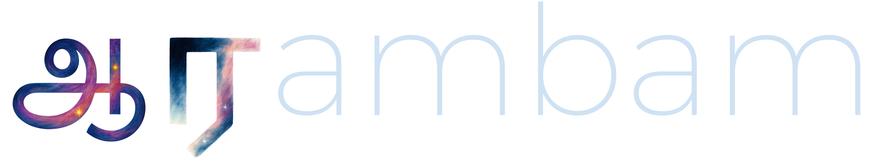

.. raw:: html

   

.. image:: LOGO_light.png
   :class: only-light
   :width: 85%
   :align: center

.. raw:: html

   

**Aarambam** is a tool for generating non-Gaussian initial conditions for N-body simulations.

.. toctree::
   :maxdepth: 2
   :caption: Contents
   :hidden:

   installation
   api_reference

Indices and tables
-------------------

* :ref:`genindex`
* :ref:`modindex`
* :ref:`search`